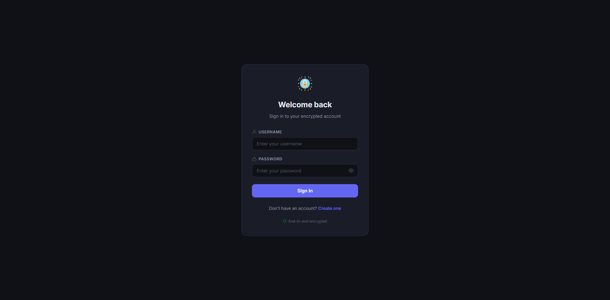
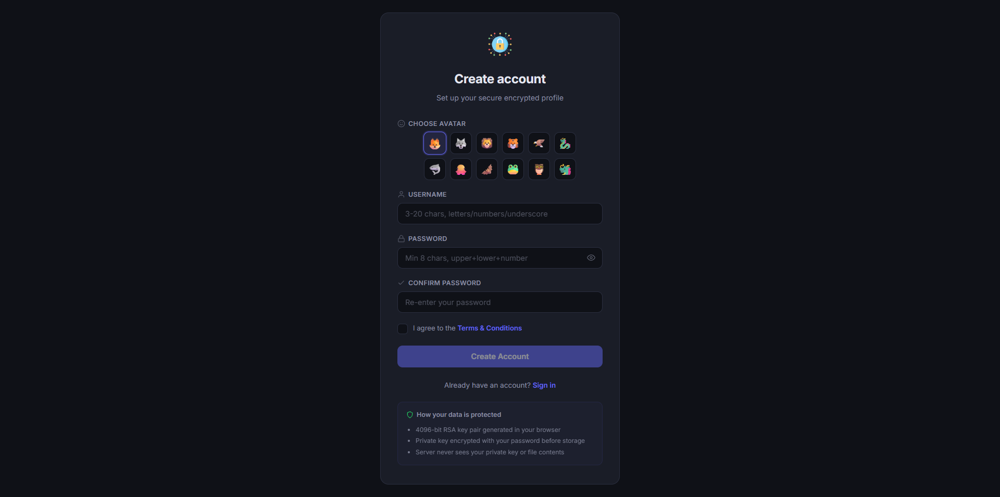
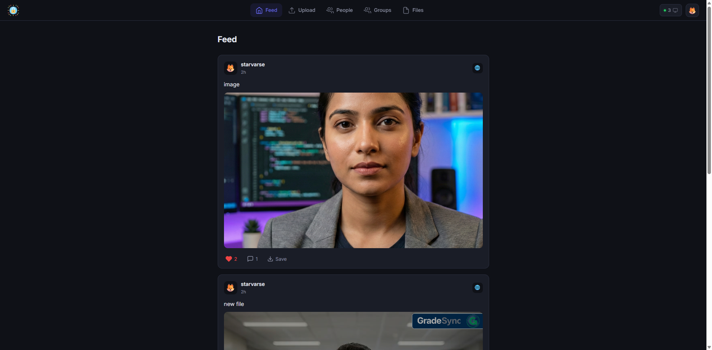
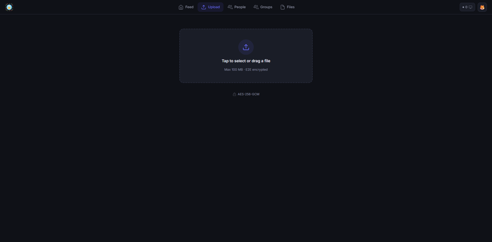
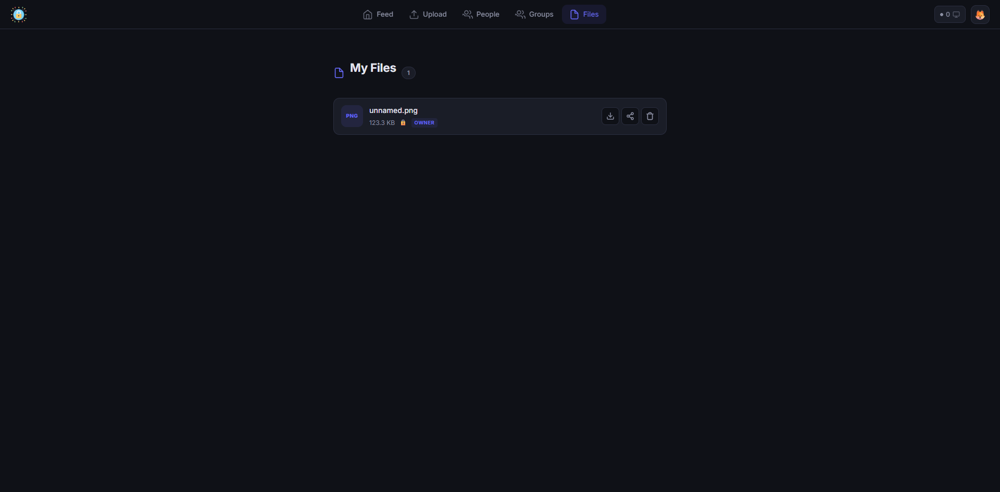
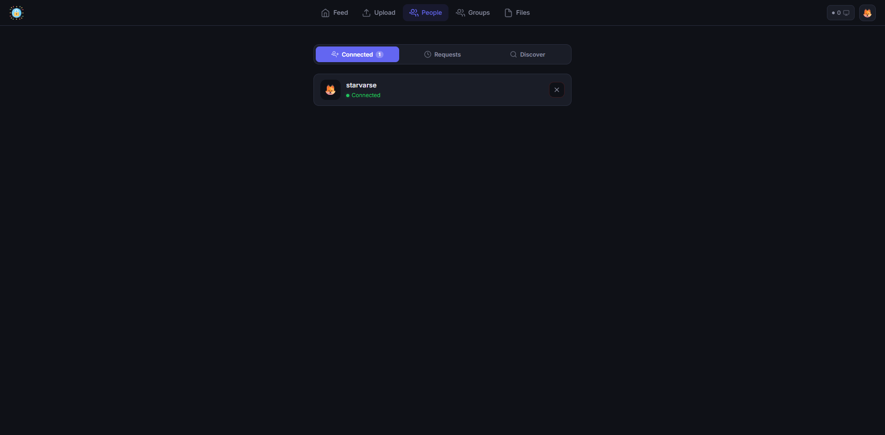
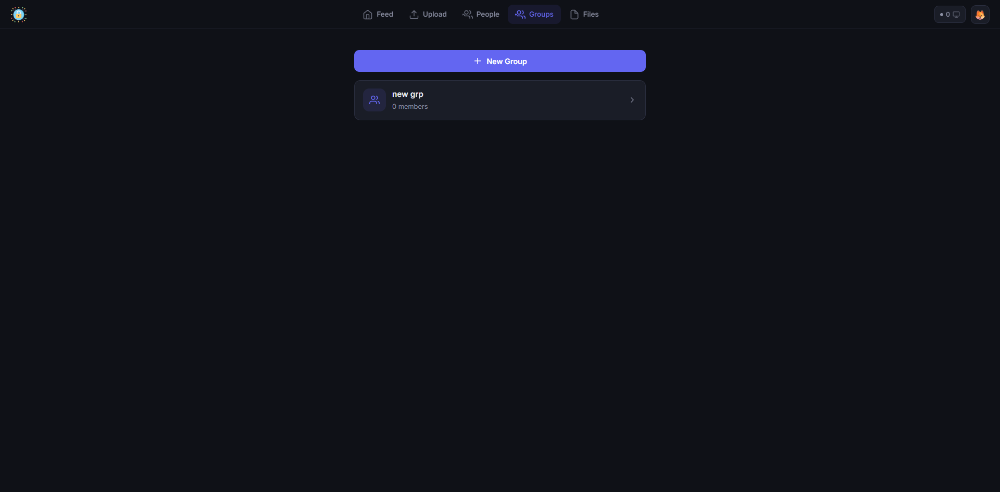
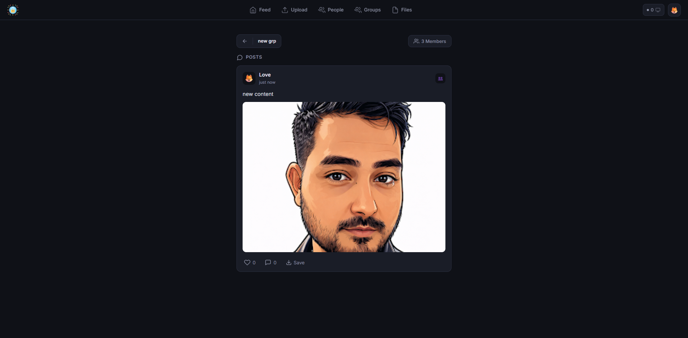

<p align="center">
  
</p>

<h1 align="center">E2E</h1>

<p align="center">
  <strong>Zero-knowledge encrypted file sharing for private communities.</strong>
</p>

<p align="center">
  <a href="#-quick-start"></a>
  <a href="#-self-hosting-guide"></a>
  <a href="https://github.com/starrvarse/end2end"></a>
</p>

<p align="center">
  
  
  
  
  
</p>

<br />

<p align="center">
  <em>Your files. Your keys. Your network. No cloud. No compromise.</em>
</p>

---

## 📸 Screenshots

<table>
  <tr>
    <td align="center"><strong>Sign In</strong><br /></td>
    <td align="center"><strong>Sign Up</strong><br /></td>
  </tr>
  <tr>
    <td align="center"><strong>Feed</strong><br /></td>
    <td align="center"><strong>Upload</strong><br /></td>
  </tr>
  <tr>
    <td align="center"><strong>My Files</strong><br /></td>
    <td align="center"><strong>Connections</strong><br /></td>
  </tr>
  <tr>
    <td align="center"><strong>Groups</strong><br /></td>
    <td align="center"><strong>Group Feed</strong><br /></td>
  </tr>
</table>

---

## 🎯 What is E2E?

Most file-sharing platforms store your data on centralized servers where the provider can read, scan, or hand over your files to third parties. **E2E takes a fundamentally different approach.**

> **E2E is a self-hosted, LAN-first platform** where a group of people can share encrypted files, form connections, create groups, and interact through a social feed — all while maintaining **true end-to-end encryption.**

### Who is this for?

| 👨‍👩‍👧‍👦 Families | 👥 Teams | 🏢 Organizations |
|---|---|---|
| Share private photos and documents at home | Collaborate with sensitive files on an office network | Air-gapped file sharing with zero cloud dependency |

---

## 💡 Why Open Source?

We believe that **privacy tools have no business being closed-source.**

When an app claims to encrypt your data, you shouldn't have to take their word for it. You should be able to **read every line of code**, verify the encryption is real, and confirm that no backdoors exist. That's why E2E is fully open source.

### Our reasoning:

- **🔍 Trust through transparency** — Anyone can audit the code and verify that encryption actually works as described. No hidden telemetry, no secret key escrow, no silent logging.

- **🛡️ Security by scrutiny** — Closed-source security is just security by obscurity. Real security survives public inspection. We *want* researchers and developers to examine our crypto implementation.

- **🌍 Privacy is a public good** — Encryption tools should be accessible to everyone — not locked behind subscriptions, enterprise tiers, or walled gardens. If privacy is a right, the tools to exercise it should be free.

- **🤝 Community-driven improvement** — One team can miss vulnerabilities. A community of contributors, testers, and security researchers makes the platform stronger than we ever could alone.

- **🚫 No vendor lock-in** — Your data, your server, your rules. If we disappear tomorrow, the code is still yours. Fork it, modify it, run it forever.

> *"If you can't see how your encryption works, you can't know if it actually does."*

---

## ✨ Features

<table>
  <tr>
    <td>

### 🔒 File Management
- **Encrypted upload** — AES-256-GCM encryption in-browser before upload
- **Chunk-based storage** — Files split and distributed to connected devices
- **Encrypted download** — Chunks reassembled and decrypted locally
- **My Files** — View, download, share, and delete your files

</td>
    <td>

### 🌐 Social Platform
- **Feed** — Social feed with file previews (images, video, audio)
- **Connections** — Send and accept friend requests
- **Groups** — Create groups, add members, share within groups
- **Posts** — Share with captions, control visibility
- **Comments & Likes** — Interact with shared posts

</td>
  </tr>
</table>

### 🛡️ Security at Every Layer
| Feature | Implementation |
|---|---|
| Key Pairs | **RSA-4096** generated in-browser during signup |
| File Encryption | **AES-256-GCM** — unique key per file |
| Key Sharing | File keys **wrapped with recipient's RSA public key** |
| Server Knowledge | **Zero** — server mathematically cannot decrypt anything |
| Sessions | **HTTP-only cookies** with 15-min access + 7-day refresh tokens |

---

## 🏗️ Technology Stack

<table>
  <tr>
    <th align="center">⚙️ Backend</th>
    <th align="center">🎨 Frontend</th>
  </tr>
  <tr>
    <td>
      <br />
      <br />
      <br />
      <br />
      <br />
      <br />
      <br />
      
    </td>
    <td>
      <br />
      <br />
      <br />
      <br />
      
    </td>
  </tr>
</table>

> **Why node-forge instead of Web Crypto API?**
> The browser's native `crypto.subtle` is only available in **Secure Contexts** (HTTPS). Since E2E runs on a **local network over HTTP**, we use `node-forge` — a pure-JavaScript crypto library that works everywhere.

---

## 🔐 How Data Is Stored — In Depth

### The Encryption Flow

```
┌──────────────────────────────────────────────────────┐
│                   YOUR BROWSER                        │
│                                                       │
│  1. You select a file                                 │
│  2. A random AES-256-GCM key is generated            │
│  3. The file is encrypted with this key              │
│  4. Encrypted data is split into chunks              │
│  5. AES key is stored in IndexedDB (your device)     │
│  6. AES key is wrapped with YOUR RSA public key      │
│     and sent to server (for multi-device access)     │
│                                                       │
│  ┌─────────┐    AES-256-GCM    ┌─────────────┐      │
│  │ Raw File │ ───────────────► │ Ciphertext   │      │
│  └─────────┘                   └──────┬──────┘      │
│                                        │              │
│                              Split into chunks        │
│                                        │              │
└────────────────────────────────────────┼──────────────┘
                                         │
                                         ▼
                              ┌─────────────────┐
                              │  Socket.IO       │
                              │  (WebSocket)     │
                              └────────┬────────┘
                                       │
                          ┌────────────┼────────────┐
                          ▼            ▼            ▼
                     ┌────────┐  ┌────────┐  ┌────────┐
                     │Device 1│  │Device 2│  │Device 3│
                     │ IndexDB│  │ IndexDB│  │ IndexDB│
                     │Chunk 0 │  │Chunk 1 │  │Chunk 2 │
                     └────────┘  └────────┘  └────────┘
```

### What the Server Stores vs. Doesn't

<table>
  <tr>
    <th>Data</th>
    <th>What's Stored</th>
    <th>Readable by Server?</th>
  </tr>
  <tr><td>👤 User account</td><td>Username, bcrypt hash, avatar ID</td><td>❌ Password is hashed</td></tr>
  <tr><td>🔑 RSA Public Key</td><td>User's public key</td><td>✅ Public by design</td></tr>
  <tr><td>🔐 RSA Private Key</td><td>Encrypted via PBKDF2</td><td>❌ Useless without password</td></tr>
  <tr><td>📄 File metadata</td><td>ID, name, size, chunk map</td><td>✅ Metadata only</td></tr>
  <tr><td>🗝️ File key shares</td><td>AES key wrapped with RSA</td><td>❌ Only recipient can unwrap</td></tr>
  <tr><td>💬 Social data</td><td>Posts, comments, likes</td><td>✅ Social metadata</td></tr>
</table>

> **The server stores ZERO bytes of file content.** No raw data, no plaintext keys, no decrypted content, no previews.

### Where File Chunks Live

Chunks are stored in **IndexedDB** inside connected browsers. The server is just a **message broker**:

```
Server (coordinator only)
  │
  ├── "Device A, do you have chunk 3 of file X?"
  │     └── Device A: "Yes, here it is" → encrypted chunk via WebSocket
  │
  └── Chunk delivered to requesting device
        └── Decrypted locally with AES key from IndexedDB
```

### Key Wrapping for Sharing

```
Your AES key  →  Wrapped with recipient's RSA-4096 Public Key
                        │
                  Stored on server as FileKeyShare
                        │
                  Recipient unwraps with their Private Key
                        │
                  Uses AES key to decrypt chunks
```

> Even with **full database access**, an attacker gets RSA-encrypted blobs — computationally infeasible to crack without the private key.

---

## 🚀 Quick Start

```bash
# Clone
git clone https://github.com/starrvarse/end2end.git
cd end2end

# Backend
cd backend
npm install
npx prisma generate
npx prisma db push
node server.js          # → http://localhost:4000

# Frontend (new terminal)
cd frontend
npm install
npm run build
npm start               # → http://localhost:3000
```

Open `http://localhost:3000` → create an account → start sharing encrypted files.

---

## 🏠 Self-Hosting Guide

### Prerequisites

| Requirement | Details |
|---|---|
| **Node.js** | Version 18 or higher |
| **npm** | Comes with Node.js |
| **Hardware** | Any machine — PC, Raspberry Pi, old laptop |
| **Network** | All devices on the same LAN |

### Step 1 → Clone

```bash
git clone https://github.com/starrvarse/end2end.git
cd end2end
```

### Step 2 → Backend Setup

```bash
cd backend
npm install
npx prisma generate
npx prisma db push
```

Create `backend/.env`:
```env
DATABASE_URL="file:./dev.db"
JWT_SECRET="your-random-secret-here-make-it-long"
FRONTEND_ORIGIN="http://localhost:3000,http://YOUR_LOCAL_IP:3000"
```

```bash
node server.js    # Starts on port 4000
```

> 💡 **Find your local IP:** Windows → `ipconfig` | macOS/Linux → `ifconfig` or `ip addr`

### Step 3 → Frontend Setup

```bash
cd ../frontend
npm install
```

Create `frontend/.env.local`:
```env
NEXT_PUBLIC_API_URL=http://YOUR_LOCAL_IP:4000
```

```bash
npm run build
npm start         # Starts on port 3000
```

### Step 4 → Connect

Open on any device on the same network:
```
http://YOUR_LOCAL_IP:3000
```

Each person creates their own account — RSA keys are generated automatically in their browser.

### 🔄 PM2 (Keep It Running Forever)

```bash
npm install -g pm2

# Start both servers
cd backend  && pm2 start server.js --name "e2e-backend"
cd ../frontend && pm2 start npm --name "e2e-frontend" -- start

# Auto-restart on reboot
pm2 save && pm2 startup
```

<details>
<summary><strong>PM2 Commands Cheatsheet</strong></summary>

```bash
pm2 list              # View running processes
pm2 logs              # View logs
pm2 restart all       # Restart everything
pm2 stop all          # Stop everything
```
</details>

---

## 🛡️ Security Analysis

### Protection Layers

| Layer | Implementation |
|---|---|
| 🔐 **Encryption** | AES-256-GCM — authenticated symmetric encryption |
| 🔑 **Key Exchange** | RSA-OAEP 4096-bit keys |
| 🔒 **Passwords** | bcrypt with salt rounds |
| 🗝️ **Key Storage** | PBKDF2-encrypted private keys |
| 🌐 **Transport** | WebSocket on LAN — data stays local |
| 🏗️ **Architecture** | Zero-knowledge — server can't decrypt |
| 🎫 **Sessions** | HTTP-only cookies + short-lived access tokens |
| 🚦 **Rate Limiting** | express-rate-limit on all endpoints |
| 🪖 **Headers** | Helmet.js security headers |

### Attack Scenarios

| 🎯 Attack Vector | 🛡️ Outcome |
|---|---|
| **Database stolen** | Attacker gets bcrypt hashes + RSA-wrapped keys. Without passwords → nothing is decryptable. |
| **Network sniffed** | Only encrypted chunks visible. Without AES keys → random noise. |
| **Rogue admin** | Can see metadata (file names, usernames). Cannot decrypt any file. |
| **Device accessed** | Active sessions are vulnerable. Always log out on shared devices. |
| **Brute force** | Rate limited. bcrypt is intentionally slow (~10 hashes/sec). |

### ⚡ Honest Limitations

> We believe in transparency, not marketing.

- **Metadata is visible** — Server knows file names, sizes, who shared with whom. Only *contents* are encrypted.
- **No forward secrecy** — Compromised private key exposes all past files shared with it.
- **HTTP on LAN** — Network traffic is unencrypted in transit. Use a reverse proxy with TLS for extra security.
- **Browser storage is fragile** — Clearing browser data destroys keys and chunks permanently.

---

## ⚠️ Responsible Use

> Any encryption tool can be used for wrong purposes. The zero-knowledge design means the server **cannot monitor, audit, intercept, or recover** file contents.

<table>
  <tr>
    <td>

**❌ Do NOT use this for:**
- Sharing illegal content of any kind
- Distributing copyrighted material
- Evading lawful investigations
- Harassment or exploitation

</td>
    <td>

**✅ DO use this for:**
- Private family photos & documents
- Sensitive business communications
- Personal media sharing
- Exercising your right to privacy

</td>
  </tr>
</table>

<p align="center">
  <strong>Privacy is a right. Abuse is a choice. Choose wisely.</strong>
</p>

If you're hosting this for a community, you are responsible for establishing acceptable use policies.

---

## 📁 Project Structure

```
end2end/
├── backend/
│   ├── server.js                # Express + Socket.IO entry point
│   ├── package.json
│   ├── prisma/
│   │   └── schema.prisma        # Database schema (SQLite)
│   ├── routes/
│   │   ├── auth.js              # Login, signup, token refresh
│   │   ├── keys.js              # RSA key storage & retrieval
│   │   ├── upload.js            # Chunk upload endpoint
│   │   ├── merge.js             # Chunk merge coordination
│   │   ├── download.js          # Chunk download routing
│   │   ├── files.js             # File metadata & listing
│   │   ├── sharing.js           # AES key wrapping & sharing
│   │   ├── connections.js       # Friend / connection management
│   │   ├── groups.js            # Group CRUD & membership
│   │   └── posts.js             # Feed, comments, likes
│   └── utils/
│       └── fileHelpers.js       # Directory & file utilities
│
├── frontend/
│   ├── package.json
│   ├── next.config.mjs
│   ├── pages/
│   │   ├── login.js             # Sign in
│   │   ├── signup.js            # Account creation + T&C
│   │   ├── feed.js              # Social feed
│   │   ├── upload.js            # File upload
│   │   ├── myfiles.js           # File management
│   │   ├── connections.js       # People & requests
│   │   ├── groups.js            # Groups listing
│   │   └── groups/[id].js       # Group detail
│   ├── components/
│   │   ├── Navbar.js            # Desktop + mobile navigation
│   │   ├── PostCard.js          # Feed post display
│   │   ├── ShareDialog.js       # File sharing modal
│   │   ├── MembersList.js       # Group members modal
│   │   └── AuthGuard.js         # Auth protection wrapper
│   ├── lib/
│   │   ├── authStore.js         # JWT auth + authFetch
│   │   ├── crypto.js            # AES-256-GCM encrypt/decrypt
│   │   ├── keyManager.js        # RSA key generation & wrapping
│   │   ├── chunkStore.js        # IndexedDB storage
│   │   ├── upload.js            # Chunked upload logic
│   │   └── useSocket.js         # Socket.IO hook
│   ├── styles/
│   │   └── globals.css          # All styles (CSS variables)
│   └── public/
│       ├── logo.png             # App logo
│       └── screenshots/         # App screenshots
│
└── README.md
```

---

<p align="center">
  <strong>Built with 🔐 by <a href="https://github.com/starrvarse">starrvarse</a></strong>
</p>

<p align="center">
  <sub>This project is open source and available for educational and personal use.</sub>
</p>
